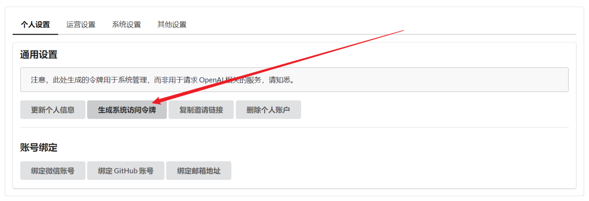
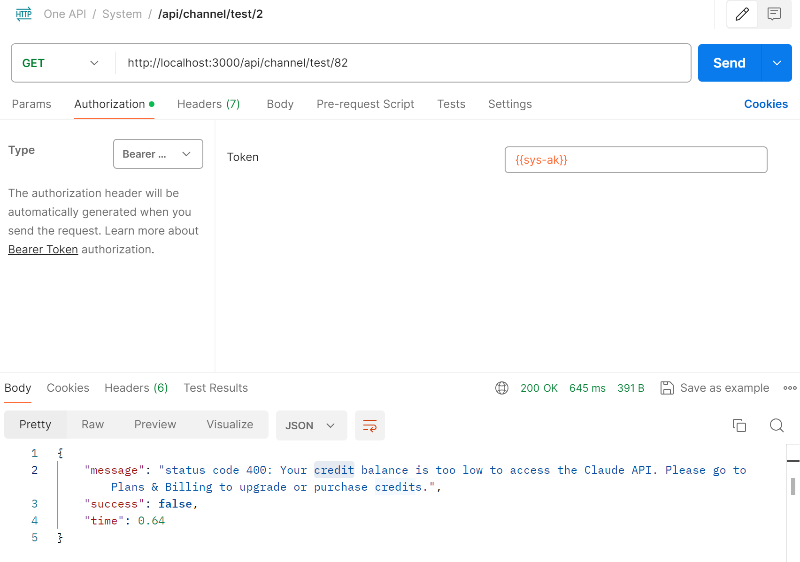

# 使用 API 操控 & 扩展 hermes-ai
> 欢迎提交 PR 在此放上你的拓展项目。

例如，虽然 hermes-ai 本身没有直接支持支付，但是你可以通过系统扩展的 API 来实现支付功能。

又或者你想自定义渠道管理策略，也可以通过 API 来实现渠道的禁用与启用。

## 鉴权
hermes-ai 支持两种鉴权方式：Cookie 和 Token，对于 Token，参照下图获取：


之后，将 Token 作为请求头的 Authorization 字段的值即可，例如下面使用 Token 调用测试渠道的 API：


## 请求格式与响应格式
hermes-ai 使用 JSON 格式进行请求和响应。

对于响应体，一般格式如下：
```json
{
  "message": "请求信息",
  "success": true,
  "data": {}
}
```

## API 列表
> 当前 API 列表不全，请自行通过浏览器抓取前端请求

如果现有的 API 没有办法满足你的需求，欢迎提交 issue 讨论。

### 获取当前登录用户信息
**GET** `/api/user/self`

### 为给定用户充值额度
**POST** `/api/topup`
```json
{
  "user_id": 1,
  "quota": 100000,
  "remark": "充值 100000 额度"
}
```

### Anthropic Messages 接口
**POST** `/v1/messages`

原生 Anthropic Messages API 转发接口，用于 Claude Code 等直接调用 Anthropic 原生协议的场景。

**请求头**：
- `Authorization`: `Bearer sk-xxx`（API Token）
- `anthropic-version`: 可选，默认为 `2023-06-01`

**请求体示例**：
```json
{
  "model": "claude-3-5-sonnet-20241022",
  "max_tokens": 4096,
  "messages": [
    {
      "role": "user",
      "content": "Hello, world!"
    }
  ],
  "stream": false
}
```

## 其他
### 充值链接上的附加参数
hermes-ai 会在用户点击充值按钮的时候，将用户的信息和充值信息附加在链接上，例如：
`https://example.com?username=root&user_id=1&transaction_id=4b3eed80-55d5-443f-bd44-fb18c648c837`

你可以通过解析链接上的参数来获取用户信息和充值信息，然后调用 API 来为用户充值。

注意，不是所有主题都支持该功能，欢迎 PR 补齐。