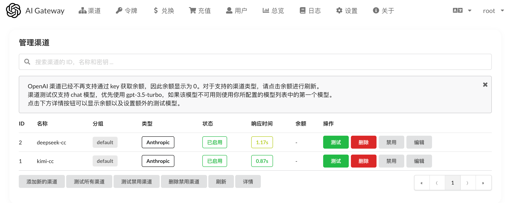
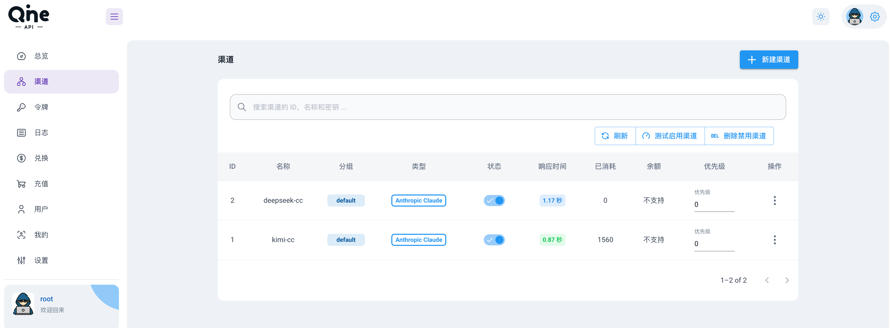
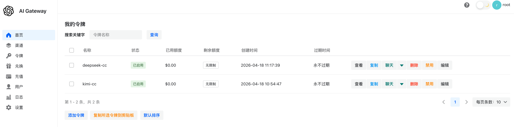

# hermes-ai 的前端界面

> 每个文件夹代表一个主题，欢迎提交你的主题

> [!WARNING]
> 不是每一个主题都及时同步了所有功能，由于精力有限，优先更新默认主题，其他主题欢迎 & 期待 PR

## 提交新的主题

> 欢迎在页面底部保留你和 hermes-ai 的版权信息以及指向链接

1. 在 `web` 文件夹下新建一个文件夹，文件夹名为主题名。
2. 把你的主题文件放到这个文件夹下。
3. 修改你的 `package.json` 文件，把 `build` 命令改为：`"build": "react-scripts build && mv -f build ../build/default"`，其中 `default` 为你的主题名。
4. 修改 `common/config/config.go` 中的 `ValidThemes`，把你的主题名称注册进去。
5. 修改 `web/THEMES` 文件，这里也需要同步修改。

## 主题列表

### 主题：default

默认主题，由 [JustSong](https://github.com/songquanpeng) 开发。

预览：

### 主题：berry

由 [MartialBE](https://github.com/MartialBE) 开发。

### 主题：air
由 [Calon](https://github.com/Calcium-Ion) 开发。

#### 开发说明

请查看 [web/berry/README.md](https://github.com/daheige/hermes-ai/tree/main/web/berry/README.md)
